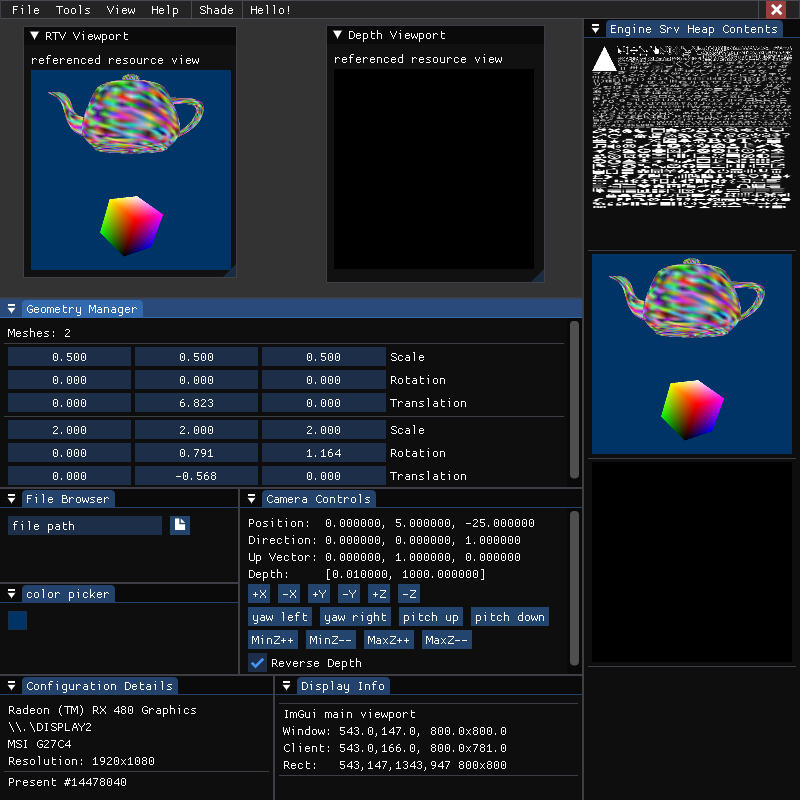

Shade
======

Shade is intended to be a learning and debugging tool. D3D12 will be used as the initial graphics backend, with a
    Vulkan one coming at a later date when app has more features and is decoupled from the rendering backend.

While the envisioned final product has menu systems galore, initial development only requires a small set of
    functionality and interactivity. Initial app will consist of a single window, with all UI elements being drawn
    inside its bounds via DX12. Window contents will consist of ImGui elements and a number of viewports. A viewport
    shows the contents of a scene, rendered with the relevant shaders, meshes, and other state. A scene may have
    multiple viewports, each differing in view, shaders, mesh visibility, etc...

Essentially the starting goal is a material editor ripped out of Blender/UE4.

Dependencies
-----
Shade currently depends on [FMT](https://github.com/fmtlib/fmt), [ImGui](https://github.com/ocornut/imgui) and [assimp](https://github.com/assimp/assimp).

Initial Features
-----
Initial goals are a shader editor and mesh viewer with UI elements like Blender and UE4.

#### Meshes
- Load from file
- Rotate, scale, translate via UI
- View metadata
- Edit mesh attributes
- Edit vertex/primitive attributes

#### Shaders
- Select shaders to use for a viewport
    - UI slots for each shader type in pipeline
- Live shader edit
    - Text editor with colorization
    - Button (F5?) to re-compile shader and pipeline
    - Compilation error feedback (both shader and pipeline)
    - View shader assembly code in form of DXIL, AMDIL, SP3, ...
    - Step through debug (RenderDoc API?)
- Construct shaders via node graph
    - Base code generation
    - Supplemental instrumentation
    - View resulting shader
    - Save as material
- Cache of recent shaders
    - Autosave with file hash
    - Option to rename and keep open

#### Current Status
Shade is currently a fixed-sized window fully rendered via ImGui with several functional menus/widgets and dockable contents. A primary pipeline renders meshes loaded via Assimp and exports its render target. Depth viewport needs post-processing. Geometry manager needs per-mesh MVP transforms.

Longer Term
-----
Longer term goal is a competent and intuitive UI with easy navigation between multiple tooling modes and/or simultaneous usage.
- Resource management
    - Memory manager to control residency
    - Batch operations
    - Task graphs
        - Shader passes
        - Resource reuse
- More resource/asset types
    - Particle systems
    - Curves/splines
    - Mesh groups/composites
- Animation and scriptable events
    - Bones
    - Timeline, key frames, interpolation
    - Scripting via Lua or Python
    - Describe scene in XML or JSON
    - Task graphs
- Levels/Tutorials
    - Shader basics
    - New shader model features
    - API visualization
    - Advanced API usage
- Physics
    - Gravitation
    - Hit-boxes
    - Rigid-body collision
    - Deformation
    - Fluids
- Error handling
    - Exceptions
    - Reports
